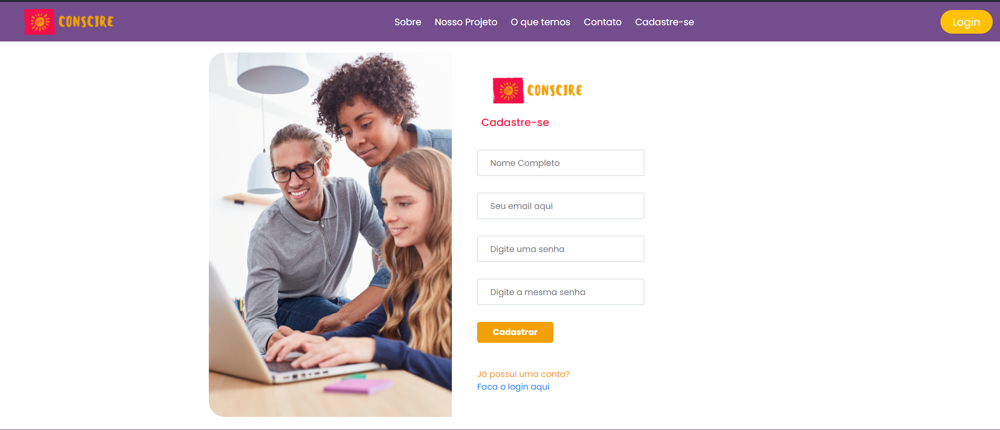
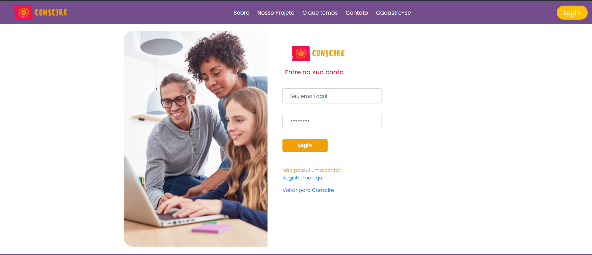

  

<h1 align="center">
    <a href="http://conscire-front.herokuapp.com/">🔗 Conscire</a>
</h1>

O Consicire e um projeto social desenvolvido para ajudar jovens de 15 a 18 em situação de vulnerabilidade levando informações sobre o álcool e seus danos em diferentes âmbitos da vida.

  <a href="#status-projeto">Status do Projeto</a> •
  <a href="#features">Features</a> •
   <a href="#demonstracao">Demonstração da aplicação</a> •

<h2 id="status-projeto">Versao 1 do projeto finalizada</h2>

A primeira versao foi finalizada no final de fevereiro de 2021.

<h2 id="features">Features</h2>

- [x] Cadastro de Usuarios
- [x] Teste Audit
- [x] Resultado Teste Audit
- [x] Quiz
- [x] Deletar usuario
- [x] Fazer comentario
- [x] Monitoramento com Google Chart
- [x] Hospedagem Frontend e Backend no Heroku

<h2 id="demonstracao">Demonstração da aplicação</h2>

Tela de Cadastro

Tela de Login

