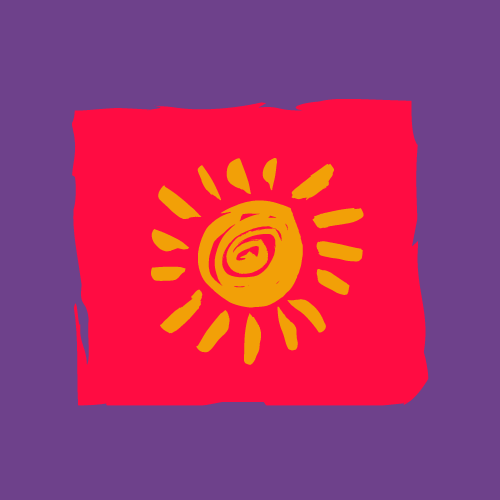

  

<h1 align="center">
    <a href="http://conscire-front.herokuapp.com/">🔗 Conscire</a>
</h1>

O Consicire e um projeto social desenvolvido para ajudar jovens de 15 a 18 em situação de vulnerabilidade levando informações sobre o álcool e seus danos em diferentes âmbitos da vida.

  <a href="#status-projeto">Status do Projeto</a> •

<h1 id="status-projeto" align="center">Versao 1 do projeto finalizada</h1>
